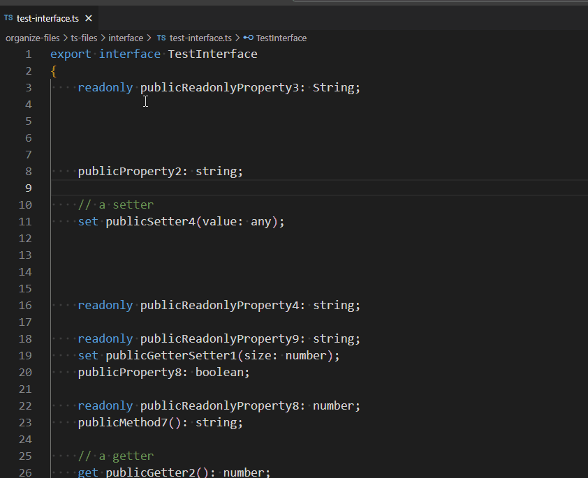
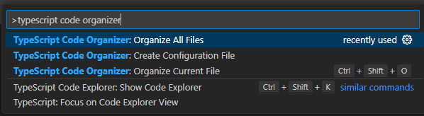
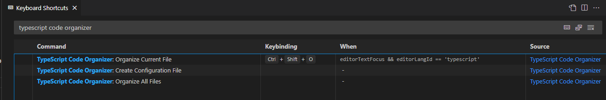
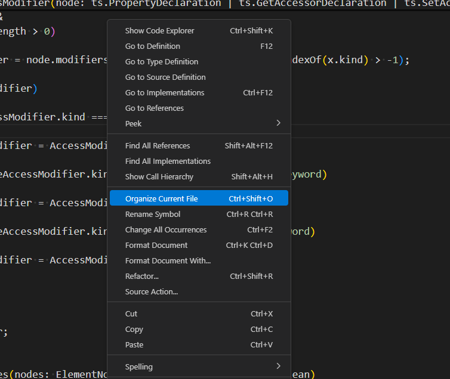
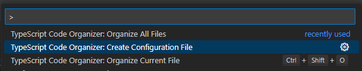

# TypeScript Code Organizer for VS Code

VS Code extension for keeping your TypeScript code organized by grouping and ordering class members.

TypeScript Code Organizer is a VS Code extension for organizing TypeScript source code in a project workspace. It allows software developers to organize import statements, modules, classes, interfaces and type members and helps them keep their source code more consistent and easier to navigate. It is highly configurable and allows sharing of the configuration across the development team. Everything from import statements, regions, grouping to sorting can be configured! It also comes as a command line tool, see [TypeScript Code Organizer Command Line Interface](https://www.npmjs.com/package/tsco-cli).

## Features

Organize currently opened TypeScript file or all TypeScript files in your project.



## Usage

### Command Palette

From the command palette you can:

- create default configuration file by invoking command `TypeScript Code Organizer: Create Configuration File`,
- organize current TypeScript file by invoking command `TypeScript Code Organizer: Organize Current File`,
- organize all TypeScript files in the project by invoking command `TypeScript Code Organizer: Organize All Files`



### Keybboard Shortcuts

You can invoke command `TypeScript Code Organizer: Organize Current File` by using the shortcut `Ctr + Shift + O`. You can change the shortcut by assigning a different shortcut to command "tsco.organize". The shortcut `Ctr + Shift + O` only works if the opened file is a TypeScript file.



### Context Menu

You can invoke command `TypeScript Code Organizer: Organize Current File` by using the context menu item.



## Extension Configuration

Extensions supports the following configuration options:

- `tsco.organizeOnSave`: Organizes TypeScripot code on save (set to false by default).
- `tsco.configurationFilePath`: Specifies the file path to the TSCO configuraiton file. Can be absolute or relative to the workspace root.

## Code Organization Configuration

Code organization is configured by a `tsco.json` configuration file. To create a default TypeScript Code Organizer configuration file, invoke the following command:



This will create a `tsco.json` file at the workspace root directory. For configuration reference, see [TypeScript Code Organizer Configuration Reference](https://www.npmjs.com/package/tsco-cli). The configuration file should be commited to the repository and shared with team members to ensure consistent code organization configuration. If you would like to specify an alternative location for the configuration file, you con do it using `tsco.configurationFilePath` setting. If no configuration file is found, TSCO will look in the parent directory until `tsco.json` or the root of file system is found. If `tsco.json` is not found, the default configuration will be used.

## Ignoring files

In order to prevent a TypeScript file being organized you can add the file to the exclude list in the configuration file files section or add one of the following comments to the top of the TypeScript file:

```typescript
// tsco:ignore
```

or

```typescript
// <auto-generated />
```

## Debugging TSCO

If you have issues with TSCO, like not using the correct configuration file, you can use tye output window to investigate issues:


## Using TypeScript Code Organizer in command line

See [TypeScript Code Organizer Command Line Interface](https://www.npmjs.com/package/tsco-cli) on NPM.

## Using TypeScrpt Code Organizer With GIT pre-commit hook

See [TypeScript Code Organizer Command Line Interface](https://www.npmjs.com/package/tsco-cli) on NPM.

## Change log

### 1.0.0

- Initial release.

### 1.0.9

- added add public modifier if missing option
- added add region Indentation option
- added end region caption option
- added organizing type aliases, interfaces, classes and functions
- fixed issue with Indentation tabs / spaces
- fixed issue when comments were preceding class members
- fixed issue when decorators were preceding class members
- fixed issue with removing redundant empty lines
- updated referenced packages

### 1.0.10

- added group properties with decorators option

### 1.0.11

- fixed issue with duplicated regions
- addded grouping by decorator for all elements, not just properties when grouping by decorators
- added a new line between group with decorators and group without decorators when grouping by decorators

### 1.0.12

- removed limitation where extension can be activated only when not in debug mode
- fixed bug where redundant empty lines were not removed correctly
- fix bug where public access modifier was not added to methods

### 1.0.14

- added option of adding number of members within a region (courtesy of [pillont](https://github.com/pillont))
- added option to output accessors before constructor (courtesy of [pillont](https://github.com/pillont))

### 1.0.15

- add option to customize grouping and ordering of members

### 1.0.16

- fix bug where accessors (getters and setters) got removed when organizing a class

### 1.0.17

- added option to treat arrow function properties as methods (courtesy of [testpossessed](https://github.com/testpossessed))
- fix bug where assync methods were not assigned a public access modifier correctly

### 1.0.19

- added option organize file on save

### 1.0.21

- fixed issue where static members without an access modifier were not correctly decorated with the public access modifier

### 1.0.23

- fixed issue where a redundant empty line was added when organising arrow type method properties
- fixed issue where default access modifier is not correctly set
- fixed issue where invalid member names are used
- trigger organizing members only if manually saving the file and not if autosave is on in VS Code (courtesy of [Donny Verduijn](https://github.com/DonnyVerduijn))

### 1.0.24

- add support for private identifiers for properties and methods

### 1.0.25

- fix issue where intefaces lost getters/setters when organizing
- add support for a special member list to be put at the top or bottom of a member group

### 1.0.26

- update README

### 1.0.27

- add support for organizing accessors
- add support for organizing static block declarations
- add support for organizing functions outside of classes
- add support for ignoring files

### 1.0.28

- fix TS reference error

### 1.0.29

- fix accessor issue when decorator contains a parameter with the name of the field

### 1.0.31

- add organizing document on saving in any mode (not just manual saving) (courtesy of [Christopher Robinson](https://github.com/Christopher-C-Robinson))

### 2.0.5

- **configuration is no longer compatible with 1.x.x as version 2.x.x uses a configuration file**
- merged functionality with [TypeScript Class Organizer CLI](https://www.npmjs.com/package/tsco-cli)

  - added support for configuration files
  - added support for organizing import statements
  - added ability to include/exclude files
  - added support for organizing modules, interfaces and type aliases
  - added more fine-grained support for treating arrow function variables and constants
  - added more fine-grained configuration for module organization
  - added more fine-grained configuration for interface organization
  - added more fine-grained configuration for type alias organization

- added ability to create a default configuration file

- added support for regular expressions and globs when putting members above or below the member type group

- added support for sorting member type groups asc, desc or no sorting

### 2.0.7

- added debugging output
- added saving changes on organizing
- added configuration file path setting
- fix issue with missing typescript dependency
- fix module formatting issue
- fix issue with import statements with  comments
- fix issue with sorting members with dependencies
- fix organizing imports with type aliases
